

  

  
  
  
  
  
   
  
   
  
  

   
  
  **Status do Projeto:** _Concluido_ 
   
  Acesse o projeto [aqui.](https://bobs-burguer.vercel.app/)

## Índice

- [Índice](#índice)
- [1. Resumo do Projeto 🍔🎯](#1-resumo-do-projeto-)
- [2. Histórias de Usuário 📚](#2-histórias-de-usuário-)
- [3. Fluxogramas📏📑](#3-fluxogramas)
- [4. Protótipos de Alta Fidelidade e Funcionalidades 🎨](#4-protótipos-de-alta-fidelidade-e-funcionalidades-)
  - [4.1 Tela de Login 💻](#41-tela-de-login-)
  - [4.2 Perfil: Garçom/Garçonete 💁‍♀️](#42-perfil-garçomgarçonete-️)
  - [4.3 Perfil: Chefe de Cozinha 👩‍🍳](#43-perfil-chefe-de-cozinha-)
  - [4.4 Perfil: Administrador 👩‍💻](#44-perfil-administrador-)
- [5. Sobre as desenvolvedoras 👩‍🎨](#5-sobre-as-desenvolvedoras-)
  
***

## 1. Resumo do Projeto 🍔🎯

O projeto foi conduzido com o intuito de desenvolver uma interface de pedidos para um pequeno restaurante de hambúrgueres, utilizando um tablet, visando aprimorar a agilidade e a organização do processo de pedidos, permitindo que o restaurante possa atender seus clientes de forma mais eficiente. O projeto teve como tema principal Bob Esponja, e para sua implementação utilizou-se o framework REACT, uma tecnologia de desenvolvimento de interfaces de usuário. Além disso, foram realizados consumos de APIs para integrar o sistema com outras ferramentas e serviços, proporcionando uma experiência completa e interativa aos usuários.

## 2. Histórias de Usuário 📚

  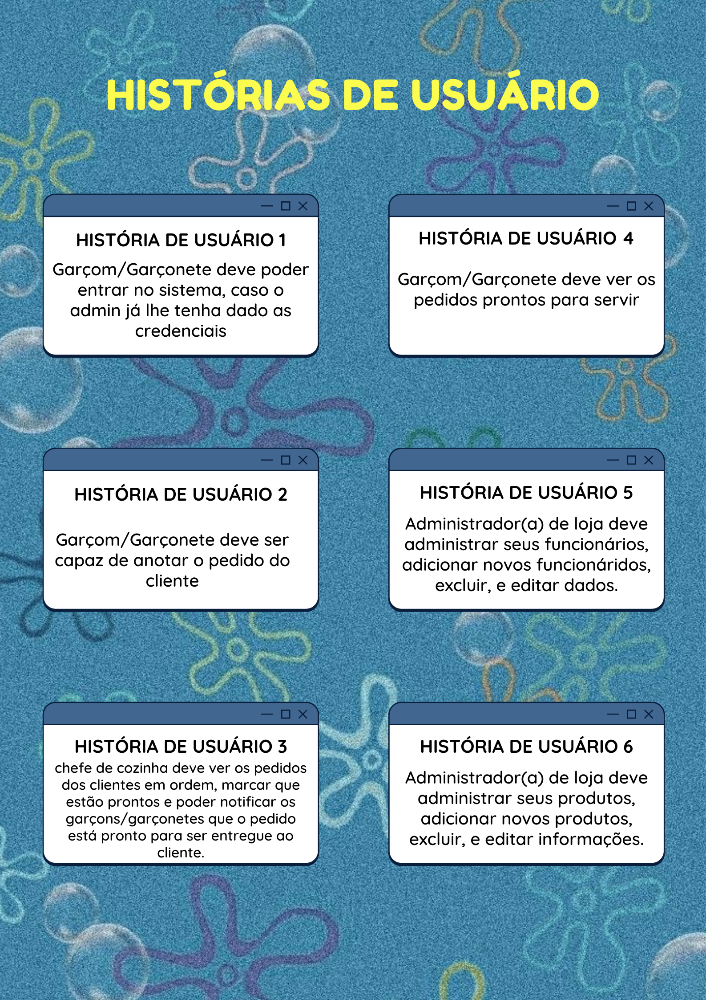

## 3. Fluxogramas📏📑

Para melhorar a compreensão e o planejamento da aplicação, foi desenvolvido um fluxograma detalhado que descreve as funcionalidades disponíveis para cada cargo de usuário. Cada história de usuário foi cuidadosamente mapeada no fluxograma, permitindo uma compreensão clara das ações e responsabilidades associadas a cada acesso na aplicação. Esse processo de mapeamento foi essencial para garantir que cada cargo tenha as permissões adequadas e possa desempenhar suas tarefas de maneira eficiente. O fluxograma serve como uma referência visual valiosa durante o desenvolvimento e a manutenção contínua da aplicação, ajudando a garantir que todas as necessidades e requisitos de cada cargo sejam atendidos de forma adequada e intuitiva.

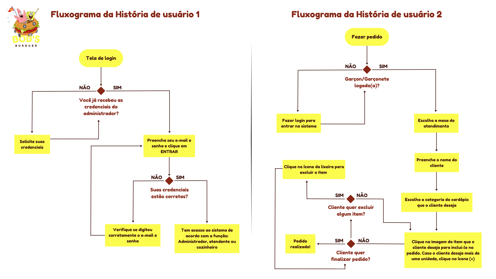
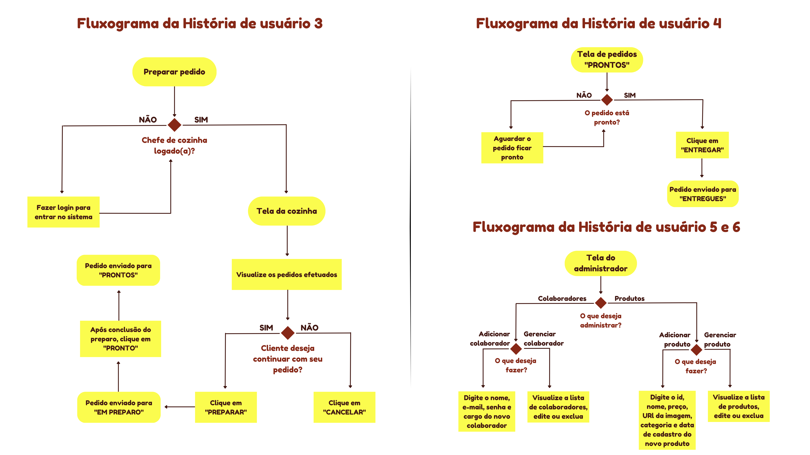

## 4. Protótipos de Alta Fidelidade e Funcionalidades 🎨

### 4.1 Tela de Login 💻

A tela de login é o ponto de acesso ao `Bob's Burguer`. Para entrar, você receberá do administrador um email e senha. Essas informações serão fornecidas levando em consideração o seu cargo e responsabilidades dentro do estabelecimento.

Após efetuar o login com sucesso, você será direcionado à sua área de trabalho personalizada. Dependendo do seu cargo, as telas subsequentes serão adaptadas para fornecer a visualização mais adequada às suas funções.

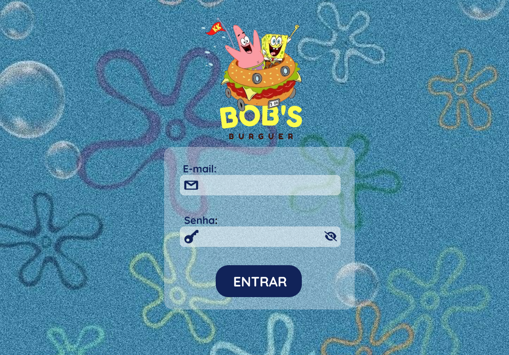

<h4> Quer testar? </h4>

Se quiser testar nossa aplicação, segue às credenciais: 

|      |          Garçom/Garçonete         |      Chefe de Cozinha           |     Administrador    |
|------|-------------------------|-------------------------|-------------------------|
|  📨  |     atendente@bobsburguer.com    |    cozinha@bobsburguer.com  |  admin@bobsburguer.com       |
|  🔐  |         123456          |         123456          |        123456           |

### 4.2 Perfil: Garçom/Garçonete 💁‍♀️

Após efetuar o login, os garçons/garçonetes terão acesso à página inicial do sistema, que apresenta um menu lateral intuitivo com diferentes opções para facilitar o gerenciamento de pedidos,  além de oferecer uma visão geral das mesas disponíveis, identificadas pelos seus respectivos números.

Para registrar um novo pedido, o garçom/garçonete deverá escolher a mesa correspondente e para gerenciar os pedidos que já foram realizados e enviados para a cozinha, na seção "Prontos", será possível visualizar todos os pedidos que estão prontos para serem entregues aos clientes. Enquanto na seção "Entregues", poderão verificar os pedidos que já foram entregues com sucesso. Caso seja necessário fazer um novo pedido, basta selecionar a opção "Fazer pedido" no menu para retornar à tela de mesas.

Com a implementação desse sistema eficiente, o gerenciamento de pedidos é simplificado, permitindo que os garçons/garçonetes atendam os clientes de forma ágil e organizada, garantindo uma experiência mais eficiente para todos.

<h5> Tela inicial vista pelo garçom/garçonete </h5>

 
<h5> Tela vista pelo garçom/garçonete ao clicar em "Prontos" </h5>

 
<h5> Tela vista pelo garçom/garçonete ao clicar em "Entregues" </h5>
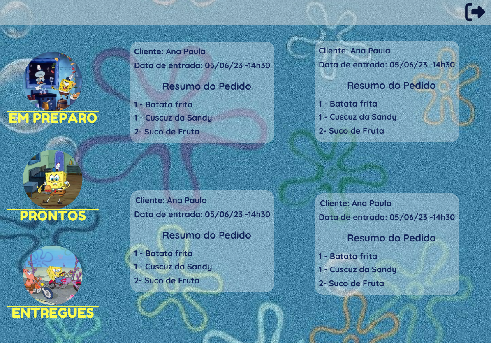
 

Após selecionar a mesa desejada, o garçom/garçonete será redirecionado(a) para a tela de realização do pedido do cliente. Nessa tela, terá acesso ao cardápio completo, com a opção de aplicar filtros, como "Café da Manhã", "Hambúrgueres", "Acompanhamentos" e "Bebidas", para facilitar a busca dos itens desejados.

Ao selecionar um produto, este será automaticamente exibido no resumo do pedido. O garçom/garçonete também terá a possibilidade de ajustar a quantidade do item, aumentando ou diminuindo, além de poder excluí-lo, caso necessário.

Para concluir o pedido com sucesso, será necessário inserir o nome do cliente e clicar no botão "Confirmar", garantindo assim que todas as informações estejam corretas antes de finalizar o pedido.

<h5> Tela de pedidos </h5>
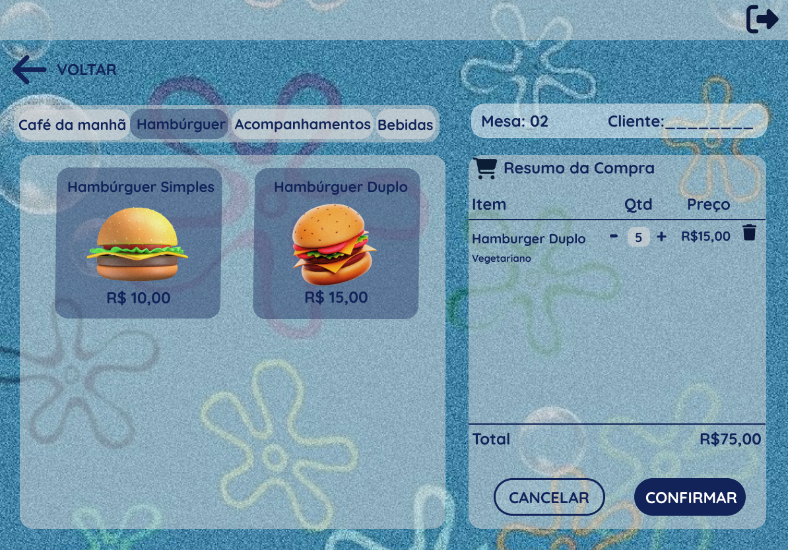
 
<h5> Tela de confirmação de pedidos </h5>
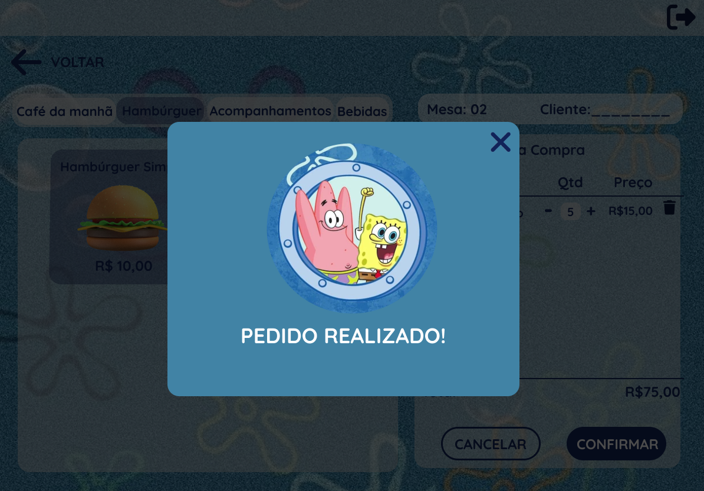

### 4.3 Perfil: Chefe de Cozinha 👩‍🍳

Após efetuar o login, o chefe de cozinha terá acesso à página principal da plataforma de gestão de pedidos, que oferece um menu lateral repleto de funcionalidades para facilitar o trabalho na cozinha.

Na seção "Pendentes", o chefe de cozinha poderá visualizar de forma clara e organizada todos os pedidos realizados pelos garçons/garçonetes. Nessa etapa, terá a opção de selecionar a função "Preparar" para iniciar o processo de preparo do pedido. Caso necessário, também poderá optar por "Cancelar" para excluir o pedido.

Na seção "Em Preparo", o chefe de cozinha terá um acompanhamento detalhado dos pedidos que estão em processo de preparo. Terá a opção de marcar um pedido como "Pronto" assim que estiver finalizado, alterando o status do pedido.

Na seção "Prontos", serão exibidos todos os pedidos que estão prontos para serem entregues aos clientes. Nesse momento, os garçons/garçonetes terão acesso imediato a esses pedidos, possibilitando a entrega aos clientes correspondentes.

Com todas essas funcionalidades integradas, o chefe de cozinha terá maior controle sobre os pedidos, agilizando o processo de preparo e garantindo uma coordenação eficiente entre a cozinha e o atendimento. Essa abordagem resultará em uma experiência aprimorada para os clientes, com pratos preparados de forma ágil e entregues com qualidade.

<h5> Tela inicial vista pelo chefe de cozinha - Pedidos pendentes </h5>

 
<h5> Tela vista pelo chefe de cozinha ao clicar em "Em Preparo" </h5>
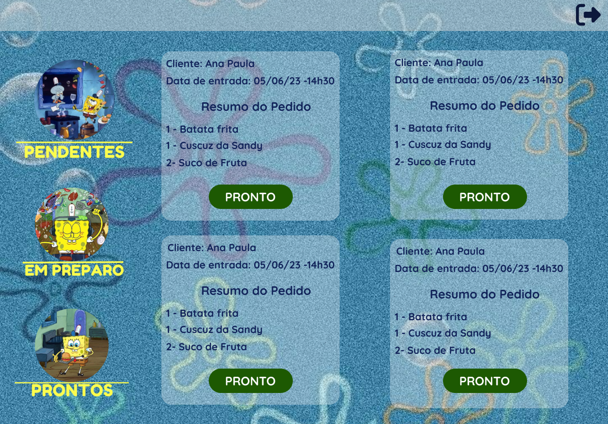
 
<h5> Tela vista pelo chefe de cozinha ao clicar em "Prontos" </h5>
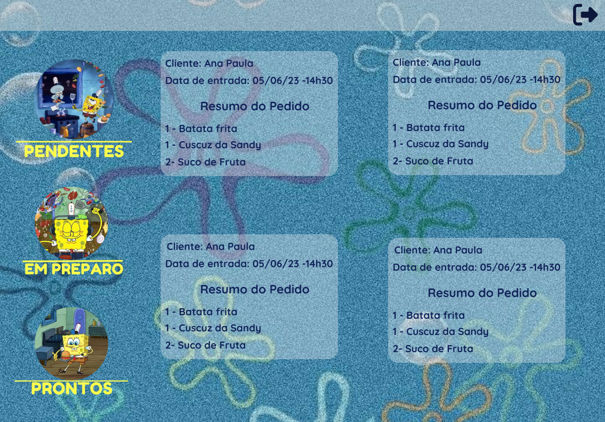
 
<h5> Tela vista pelo chefe de cozinha quando não há pedidos para exibição. </h5>
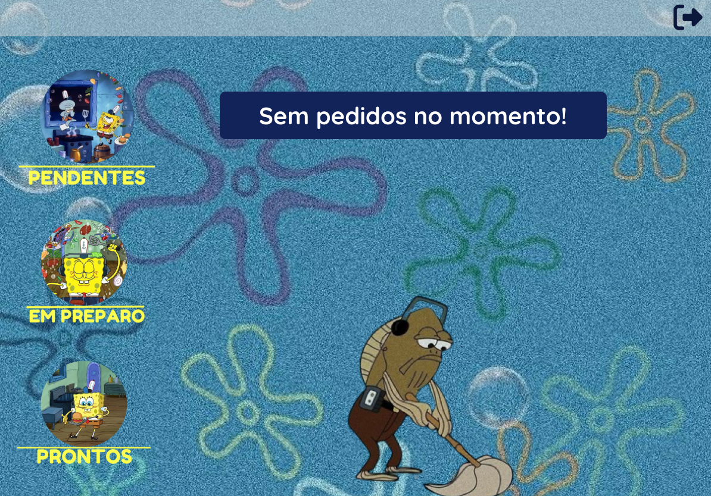

### 4.4 Perfil: Administrador 👩‍💻

Após efetuar o login, o administrador terá acesso à página inicial do sistema, que apresenta um menu com duas opções principais.

Ao selecionar "Administrar Colaboradores" no menu, o administrador terá acesso a um submenu onde poderá escolher entre "Adicionar Colaborador" para incluir um novo membro na equipe ou "Gerenciar Colaborador" para editar ou excluir informações de colaboradores existentes.

Da mesma forma, ao optar por "Administrar Produtos" no menu, o administrador poderá selecionar "Adicionar Produto" para incluir um novo item ao catálogo ou "Gerenciar Produto" para editar ou excluir informações de produtos existentes.

Essas funcionalidades oferecem ao administrador uma gestão eficiente da equipe de colaboradores, permitindo adicionar novos membros quando necessário e realizar ajustes ou exclusões conforme a demanda. Além disso, o administrador pode manter o controle dos produtos, adicionando novos itens ao cardápio ou realizando ajustes conforme necessário para atender às necessidades do estabelecimento. Essa abordagem contribui para uma gestão eficaz da equipe e dos recursos disponíveis na cozinha, garantindo um funcionamento otimizado do sistema!

<h5> Menu visto pelo administrador ao efetuar login</h5>

 
<h5> Menu visto ao clicar em "Administrar Colaboradores" </h5>
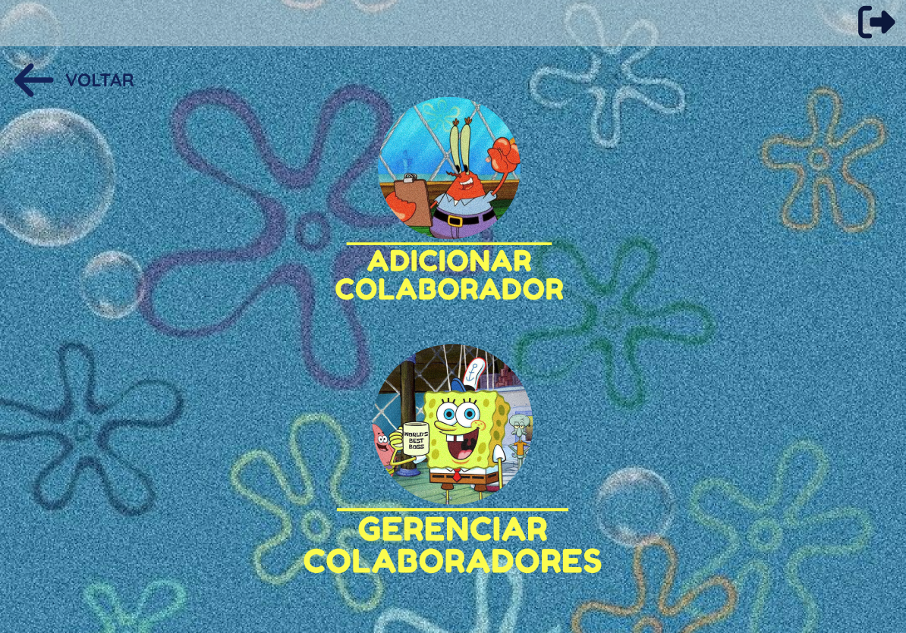
 
<h5> Tela vista ao clicar em "Adicionar Colaborador" </h5>
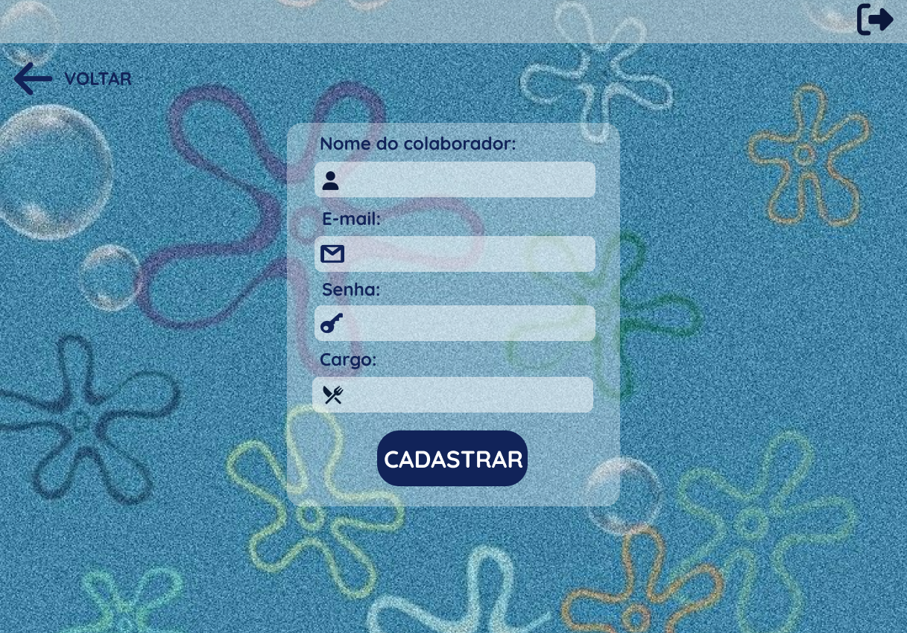
 
<h5> Tela vista ao clicar em "Gerenciar Colaboradores" </h5>
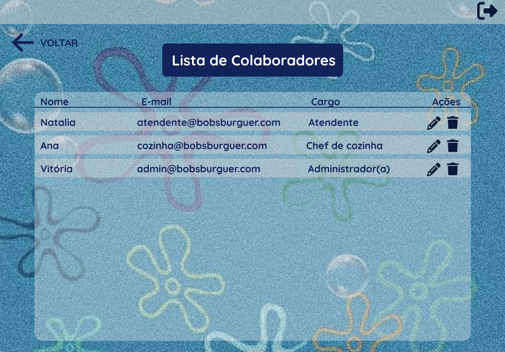
 
<h5> Menu visto ao clicar em "Administrar Produtos" </h5>
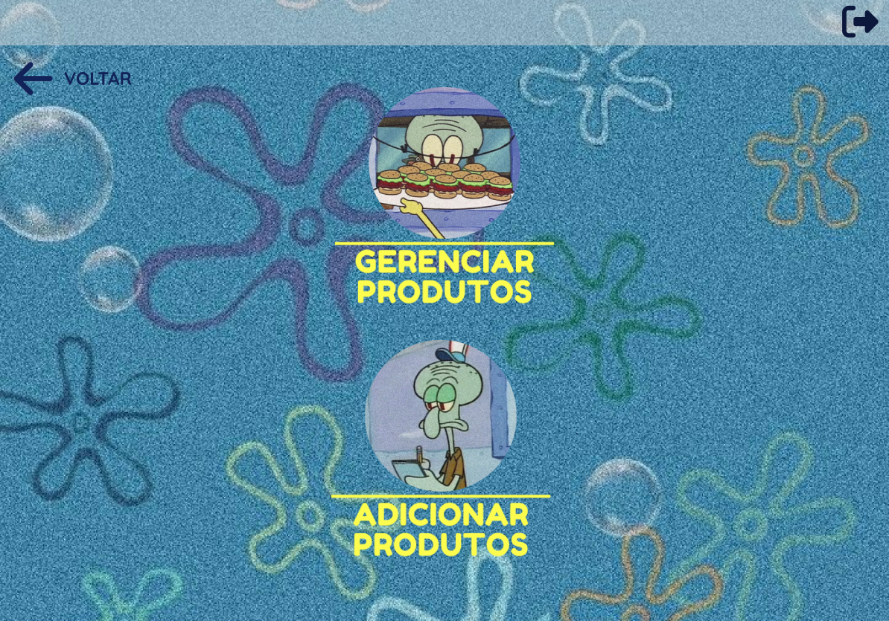
 
<h5> Tela vista ao clicar em "Adicionar Produtos" </h5>

 
<h5> Tela vista ao clicar em "Gerenciar Produtos" </h5>
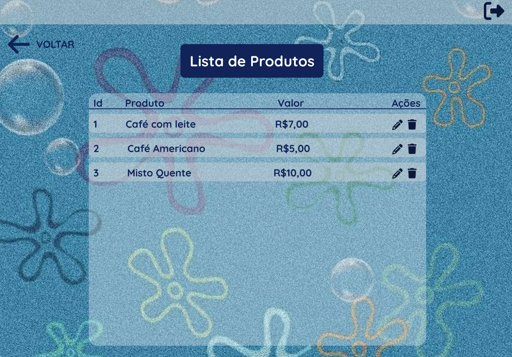

## 5. Sobre as desenvolvedoras 👩‍🎨

|                             Ana Paula Januário 🐝                      	      |                              Paola Oliveira 🔮                               	|
|:------------------------------------------------------------------------------: |:------------------------------------------------------------------------------:	|
|</img> | </img> 	|
| <a href='https://github.com/paulajanu'></img></a> <a href='https://www.linkedin.com/in/ana-paula-januario/'></img>  |  <a href='https://github.com/paola-oliveira'></img></a> <a href='https://www.linkedin.com/in/paola-natalia-oliveira/'></img></a> 	|          	|

