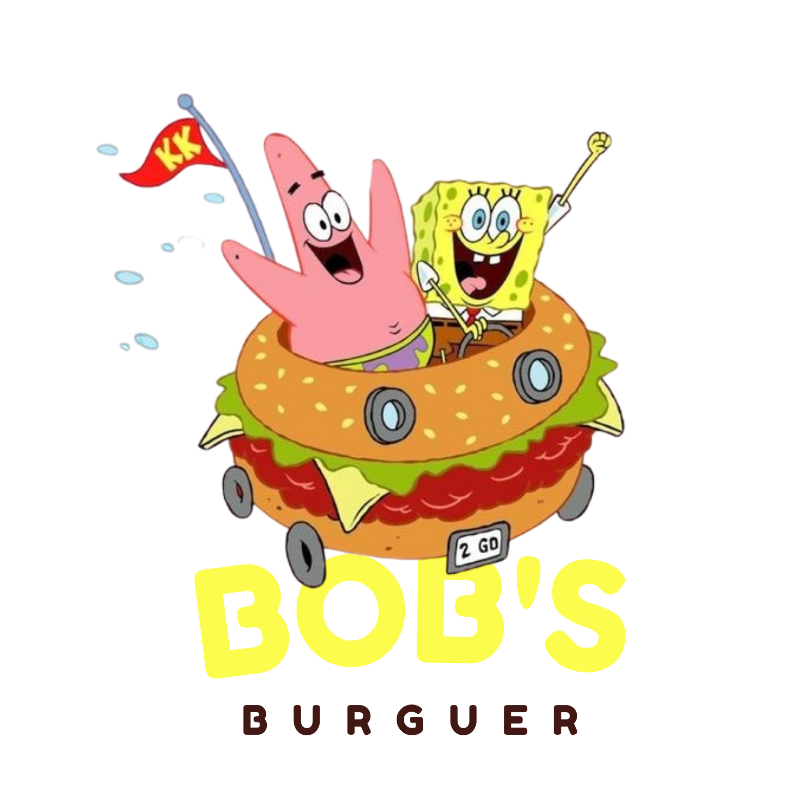

  

# BOBS-BURGUER

O projeto consiste em desenvolver uma interface de pedidos para um restaurante de hambúrgueres utilizando um tablet. O objetivo é agilizar e ordenar o processo de pedidos para que o restaurante possa atender seus clientes de forma mais eficiente. O tema escolhido para o projeto é Bob Esponja. Para isso, será utilizado o framework REACT, uma tecnologia de desenvolvimento de interfaces de usuário, e serão realizados consumos de APIs para integrar o sistema com outras ferramentas e serviços.

<h2> 🚧 EM CONSTRUÇÃO 🚧 <h2> 

